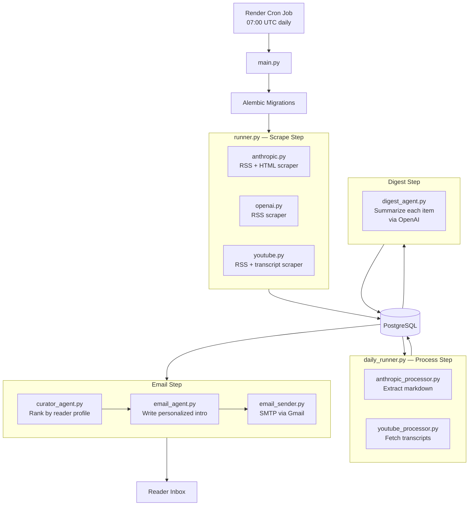

# AI News 

A self-hosted daily AI news briefing pipeline. Every morning it scrapes AI news from Anthropic, OpenAI, and YouTube, generates AI-powered summaries, ranks them against a reader profile, and delivers a personalized email digest.

---

## How It Works

The pipeline runs once daily (via Render cron job) and executes four steps in sequence:

```
1. Scrape    → Fetch new articles and videos from all sources
2. Process   → Extract full markdown (Anthropic) and transcripts (YouTube)
3. Digest    → Summarize each item with an AI agent
4. Email     → Rank by reader profile, generate intro, send briefing
```

Each step is fault-tolerant — a failure in one source does not block the rest of the pipeline.

---

## Architecture



### File Structure

```
my-ai-news/
├── app/
│   ├── agents/
│   │   ├── base_agent.py          # Shared OpenAI client setup
│   │   ├── digest_agent.py        # Summarizes articles into digest entries
│   │   ├── curator_agent.py       # Ranks digests against a reader profile
│   │   ├── email_agent.py         # Writes personalized email intro
│   │   └── user_profile.py        # Reader interest profiles
│   ├── database/
│   │   ├── models.py              # SQLAlchemy ORM models
│   │   ├── repository.py          # All DB read/write operations
│   │   ├── connection.py          # Engine and session factory
│   │   └── create_tables.py       # Local dev utility
│   ├── scrapers/
│   │   ├── anthropic.py           # RSS + HTML-to-markdown scraper
│   │   ├── openai.py              # RSS scraper
│   │   └── youtube.py             # RSS + transcript API scraper
│   ├── services/
│   │   ├── anthropic_processor.py # Extracts markdown for Anthropic articles
│   │   ├── youtube_processor.py   # Fetches YouTube transcripts
│   │   ├── digest_processor.py    # Runs digest agent on unprocessed items
│   │   ├── email_processor.py     # Orchestrates curation and email send
│   │   ├── curator_processor.py   # Standalone debug tool for ranking
│   │   └── email_sender.py        # SMTP send via Gmail
│   ├── config.py                  # YouTube channel configuration
│   ├── runner.py                  # Scrape step: runs all scrapers and persists
│   └── daily_runner.py            # Pipeline entry point (migration + all steps)
├── migrations/                    # Alembic migration files
├── main.py                        # Docker/CLI entry point
├── Dockerfile
├── render.yaml                    # Render cron job + database config
├── pyproject.toml
└── alembic.ini
```

---

## Database

Four tables, managed via Alembic migrations:

| Table | Purpose |
|---|---|
| `anthropic_articles` | Anthropic blog posts (with extracted markdown) |
| `openai_articles` | OpenAI news articles |
| `youtube_videos` | YouTube videos (with transcripts) |
| `digests` | AI-generated summaries linked to source items; tracks `emailed_at` to avoid repeat sends |

---

## Environment Variables

| Variable | Required | Description |
|---|---|---|
| `DATABASE_URL` | Yes | PostgreSQL connection string |
| `OPENAPI_API_KEY` | Yes | OpenAI API key |
| `OPENAPI_MODEL` | Yes | Model name (e.g. `gpt-5.2`) |
| `EMAIL_SENDER` | Yes | Gmail address to send from |
| `GMAIL_APP_PASSWORD` | Yes | Gmail app password |
| `WEBSHARE_PROXY_USERNAME` | No | Proxy for YouTube transcript fetching |
| `WEBSHARE_PROXY_PASSWORD` | No | Proxy for YouTube transcript fetching |

Copy `app/example.env` and fill in your values.

---

## Local Development

### 1. Start a local PostgreSQL database

```bash
docker compose -f docker/docker-compose.yml up -d
```

### 2. Install dependencies

```bash
uv sync
```

### 3. Configure environment

```bash
cp app/example.env .env
# Fill in your API keys and DB URL
```

### 4. Run the pipeline

```bash
python main.py
```

On first run, Alembic will create all tables automatically. Pass optional args to control the lookback window and email size:

```bash
python main.py 48 5   # look back 48 hours, send top 5 articles
```

---

## Deployment (Render)

The project is configured for Render via `render.yaml`:

- **Database**: Managed PostgreSQL (`ainews-db`, free tier)
- **Cron job**: Docker container, runs daily at 07:00 UTC (`0 7 * * *`), region: Oregon
- `DATABASE_URL` is injected automatically from the managed database

To deploy: connect the repo in Render and apply `render.yaml`. Set the secret env vars (`OPENAPI_API_KEY`, `GMAIL_APP_PASSWORD`, `EMAIL_SENDER`) in the Render dashboard.

Migrations run automatically at pipeline startup via `alembic upgrade head`.

---

## Adding a New Source

1. Create a scraper in `app/scrapers/` returning a list of Pydantic article models
2. Add a DB model in `app/database/models.py` and upsert/query methods in `repository.py`
3. Create a processor in `app/services/` following the same pattern as `anthropic_processor.py`
4. Wire it into `app/runner.py` (scrape step) and `app/daily_runner.py` (process step)
5. Add digest handling in `app/services/digest_processor.py`
6. Generate a migration: `alembic revision --autogenerate -m "add_<source>_table"`
